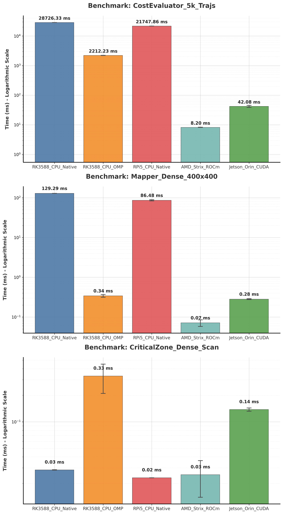

# Kompass Core Benchmarking Suite

This directory contains the performance benchmarking suite for `kompass-core`. It is designed to measure and compare the throughput of our functional components across different hardware backends (CPU, NVIDIA GPUs, AMD GPUs). These functional components are either stand alone components or utilities which are used in multiple navigation control algorithms. Since `kompass-core` implements **GPGPU** written in SYCL, we use [**AdaptiveCpp**](https://github.com/AdaptiveCpp/AdaptiveCpp) for JIT compilation to target accelerators.

The goal is to quantify the acceleration provided by our GPGPU kernels compared to the optimized C++ CPU baselines. Since the GPU code is written as `single-source-multiple-target`, this benchmarking is different from a comparison of optimized code written in the native API of the GPU manufacturer. In this case we trust the compiler (AdaptiveCpp) to provide the optimized bytecode for each accelerator. For details of how AdaptiveCpp compiled implementations compared with vendon-native compilers, you can check these [benchmarks](https://github.com/AdaptiveCpp/AdaptiveCpp/releases/tag/v25.10.0).

## 📊 Overview

We benchmark three critical components of the navigation stack:

1.  **Cost Evaluator (Motion Planning)**
    - **Workload:** Evaluates 5,000 generated trajectories (10ms time step, 10s horizon) against a reference path, smoothness constraints, and obstacle costs.
    - **Metric:** Total computation time to find the optimal trajectory.
    - **Stress Factor:** Massive parallel trajectory rollout and reduction.

2.  **Local Mapper (Occupancy Grid)**
    - **Workload:** Raycasts a dense LiDAR scan (3,600 points) into a $400 \times 400$ grid ($20m \times 20m$ @ $5cm$ resolution).
    - **Metric:** Time to update occupancy probabilities for the entire grid.
    - **Stress Factor:** Random memory access patterns and ray traversal.

3.  **Critical Zone Checker (Safety System)**
    - **Workload:** Checks a high-res 2D scan (3,600 rays) where points fall within the "slowdown" zone to force worst-case evaluation logic. This component is light-weight and highly optimized on the CPU, so performance gains are expected to be marginal. Use of the GPU is not default behaviour and left to the user.
    - **Metric:** Latency to return a safety factor $[0.0, 1.0]$.
    - **Stress Factor:** High-throughput collision checking.

---

## 🏆 Results

The plots below visualize the performance differences across platforms. The **Logarithmic Scale** plot is essential for comparing CPU vs. GPU performance where differences can be orders of magnitude large, while the **Linear Scale** plot is useful for comparing performance within similar hardware classes.

### Logarithmic Scale (CPU vs GPU Comparison)


### Linear Scale (Absolute Time)


## 🛠️ Compilation & Usage

The benchmark runner is a standalone executable (`kompass_benchmark`).

### Prerequisites

- **CMake 3.5+**
- **AdaptiveCpp** (if targeting GPU or OMP backends)
- **OpenCV, Boost Unit Test Framework, nlohmann json** (`sudo apt install nlohmann-json3-dev libopencv-dev libboost-test-dev`)
- **Python 3** + `matplotlib` (for plotting)

### 1. CPU Native Baseline (No SYCL)

Measures the pure C++ performance without SYCL parallelization.

```bash
mkdir -p build_cpu_native && cd build_cpu_native
cmake .. -DCMAKE_BUILD_TYPE=Release -DFORCE_CPU_BUILD=ON
cmake --build . --target kompass_benchmark -- -j$(nproc)

# Run
./src/kompass_cpp/benchmarks/kompass_benchmark "CPU_Native" "../benchmark_cpu_native.json"
```

### 2. CPU with SYCL (OpenMP)

Measures the performance of the GPU kernels running on the CPU via OpenMP.

```bash
mkdir -p build_cpu_sycl && cd build_cpu_sycl
cmake .. -DCMAKE_BUILD_TYPE=Release
cmake --build . --target kompass_benchmark -- -j$(nproc)

# Force OpenMP backend
ACPP_VISIBILITY_MASK=omp ./src/kompass_cpp/benchmarks/kompass_benchmark "CPU_SYCL" "../benchmark_cpu_sycl.json"
```

### 3. NVIDIA GPU (CUDA)

Targeting Jetson Orin / Xavier or other NVIDIA GPUs.

```bash
mkdir -p build_cuda && cd build_cuda
cmake .. -DCMAKE_BUILD_TYPE=Release
cmake --build . --target kompass_benchmark -- -j$(nproc)

# Force CUDA backend
ACPP_VISIBILITY_MASK=cuda ./src/kompass_cpp/benchmarks/kompass_benchmark "Jetson_Orin_CUDA" "../benchmark_cuda.json"
```

### 4. AMD GPU (ROCm/HIP)

Targeting AMD Strix Halo APUs or Radeon GPUs.

```bash
mkdir -p build_rocm && cd build_rocm
cmake .. -DCMAKE_BUILD_TYPE=Release
cmake --build . --target kompass_benchmark -- -j$(nproc)

# Force HIP backend
ACPP_VISIBILITY_MASK=hip ./src/kompass_cpp/benchmarks/kompass_benchmark "AMD_Strix_ROCm" "../benchmark_rocm.json"
```

---

## 📈 Visualizing Results

A Python script is provided to aggregate the JSON results from different machines and generate professional comparison charts.

1. Create a directory within this directory.

```bash
mkdir benchmark_files
```

2. Collect all `.json` output files (e.g., `benchmark_cuda.json`, `benchmark_cpu_native.json`) into the `benchmark_files` this directory.
3. Run the plotter:

```bash
python3 plot_benchmarks.py
```

This will generate two images:

- `benchmark_comparison_absolute.png`: Linear scale (good for similar performance classes).
- `benchmark_comparison_log.png`: Logarithmic scale (essential for comparing CPU vs GPU).

**Note:** You can configure the `BASELINE_PLATFORM` variable at the top of `plot_benchmarks.py` to automatically calculate speedup factors relative to a specific device (default: `RK3588_CPU_Native`).
